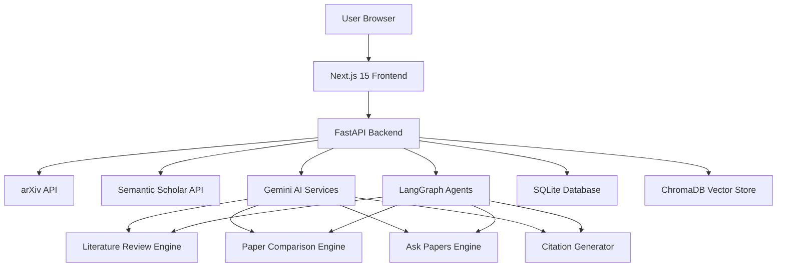
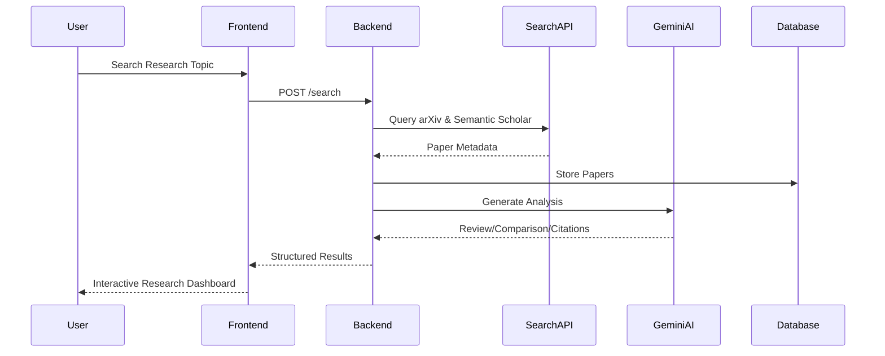
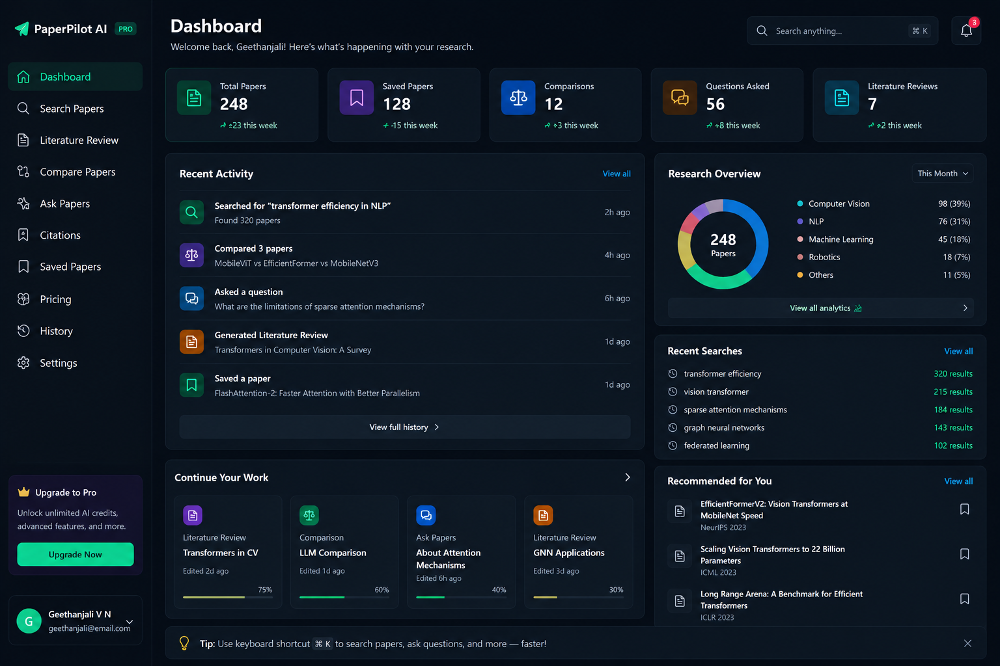
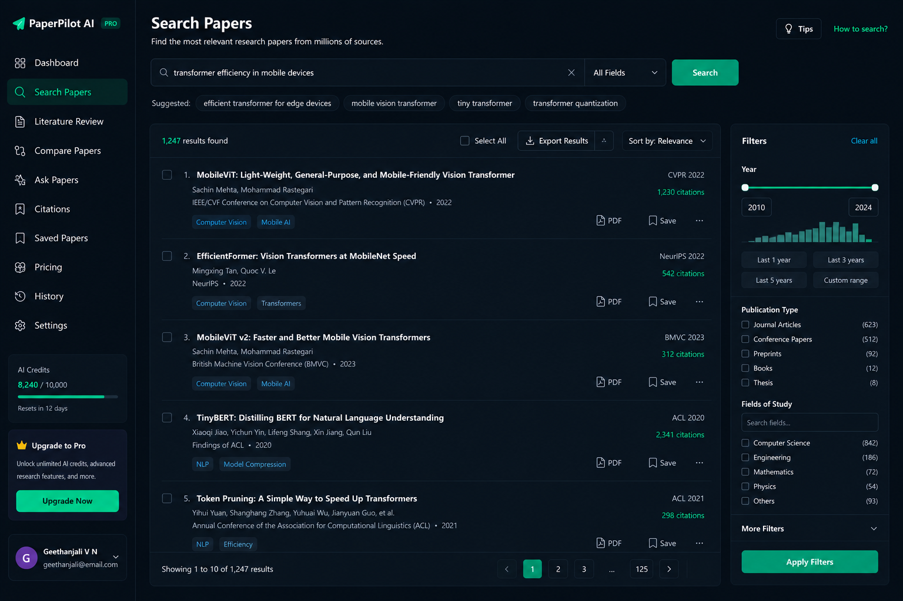
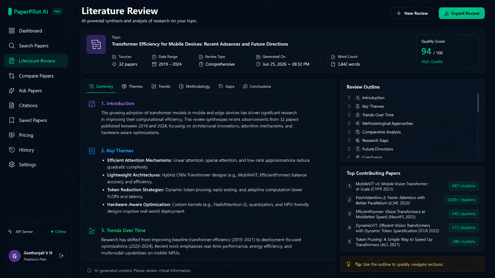
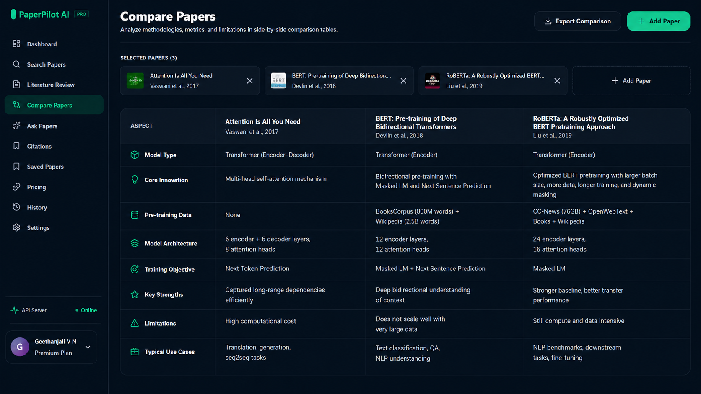
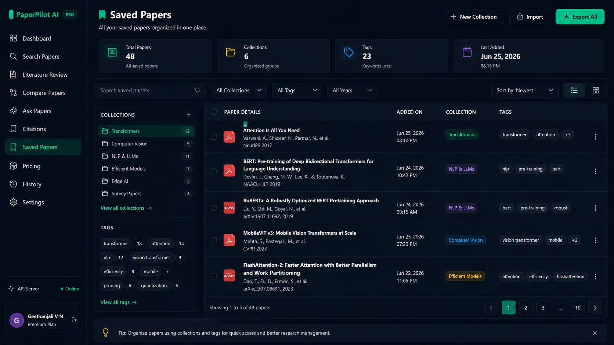
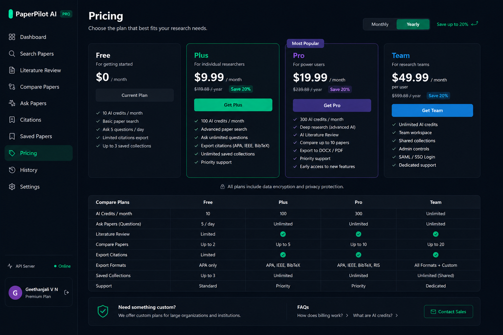

# 📚 PaperPilot AI – AI-Powered Research Operating System

PaperPilot AI is an AI-powered research operating system that helps researchers, students, and developers discover, analyze, compare, and synthesize scientific literature at scale. The platform integrates academic search engines with generative AI to automate literature reviews, methodology comparisons, conversational research exploration, and citation generation through an interactive dashboard.

---

## 🚀 Features

### 🔍 Multi-Source Research Search
- Search papers from **arXiv** and **Semantic Scholar**
- Unified search experience with filtering and ranking
- Metadata extraction and paper indexing
- Infinite scrolling and pagination support

### 📖 AI Literature Review Generation
- Generate structured literature reviews automatically
- Create introductions, methodology comparisons, findings, and future directions
- Citation-aware review generation
- Download reviews as Markdown and PDF

### ⚖️ Paper Comparison Engine
- Side-by-side comparison of research papers
- Compare:
  - Model Architectures
  - Methodologies
  - Performance Metrics
  - Limitations
  - Future Research Directions
- Export comparison reports

### 💬 Ask Papers (Research Copilot)
- Perplexity-style conversational research assistant
- Ask questions across multiple research papers
- Inline citations and source references
- Suggested follow-up questions
- Deep Scan mode for comprehensive analysis

### 📝 Citation Generator
Generate citations in multiple formats:

- APA 7th Edition
- IEEE
- BibTeX

Features:
- Copy individual citations
- Copy all citations
- Citation history tracking
- Export citation collections

### 📂 Research Workspace
- Save papers into collections
- Create custom folders
- Tag-based filtering
- Bookmark organization
- Search across saved papers

### 📊 Research Dashboard
- Papers indexed
- Reviews generated
- Saved papers statistics
- Recent activity timeline
- Quick actions dashboard

### 📱 Fully Responsive Interface
- Desktop-first research workspace
- Tablet support
- Mobile navigation
- Dark mode interface
- Smooth micro-interactions using Framer Motion

---

# 🛠️ Tech Stack

## Frontend
- Next.js 15 (App Router)
- TypeScript
- Tailwind CSS
- Framer Motion
- Zustand
- React Query
- Axios
- Lucide React
- React Markdown

## Backend
- FastAPI
- Python 3.11
- SQLAlchemy
- SQLite (WAL Mode)
- ChromaDB
- HTTPX
- Pydantic
- Uvicorn

## AI & Research Services
- Google Gemini API
- LangGraph Agent Workflows
- arXiv API
- Semantic Scholar API
- Vector Search
- Citation Generation Engine

---

# 📐 Architecture Diagram



---

# 🔄 Research Processing Flow



---

# 🚀 Core Modules

## 📊 Dashboard
- Research statistics
- Recent activities
- Quick action cards
- Indexed paper metrics
- Saved papers overview

---

## 🔍 Search Papers
- Multi-source academic search
- Metadata extraction
- Advanced filtering
- Save papers
- Citation generation shortcuts

---

## 📖 Literature Review
- AI-generated literature synthesis
- Methodology breakdowns
- Structured sections
- Export functionality
- Citation integration

---

## ⚖️ Compare Papers
- Side-by-side comparison tables
- Architecture comparison
- Performance metrics
- Strengths and limitations
- Export reports

---

## 💬 Ask Papers
- Conversational research exploration
- Inline citations
- Deep Scan mode
- Follow-up suggestions
- Context-aware responses

---

## 📝 Citations
- APA
- IEEE
- BibTeX
- Copy & export support
- Citation history

---

## 📂 Saved Papers
- Collections
- Tags
- Folder organization
- Search
- Bookmark management

---

# 📸 Application Screenshots

## Dashboard


---

## Search Papers


---

## Literature Review


---

## Compare Papers


---

## Ask Papers


---

## Citations


---

## Saved Papers


---

## Pricing


---

## Login


---

## Profile Settings


---

# 📂 Project Structure

```text
PaperPilot-AI
│
├── backend
│   ├── app
│   ├── api
│   ├── core
│   ├── models
│   ├── services
│   ├── db
│   └── tests
│
├── frontend
│   ├── src
│   │   ├── app
│   │   ├── components
│   │   ├── hooks
│   │   ├── store
│   │   ├── lib
│   │   └── types
│
├── docs
│   └── screenshots
│
└── README.md
```

---

# 📦 Installation

## Prerequisites
- Python 3.11+
- Node.js 18+
- npm
- Gemini API Key

---

# 1️⃣ Backend Setup

```bash
cd backend

python -m venv .venv

# Windows
.venv\Scripts\activate

# Linux/Mac
source .venv/bin/activate

pip install -r requirements.txt
```

Create `.env`

```env
GEMINI_API_KEY=your_api_key
DATABASE_URL=sqlite:///./data/papers.db
ENVIRONMENT=development
```

Run:

```bash
uvicorn app.main:app --reload
```

Backend:

```
http://localhost:8000
```

Swagger:

```
http://localhost:8000/docs
```

---

# 2️⃣ Frontend Setup

```bash
cd frontend

npm install
npm run dev
```

Frontend:

```
http://localhost:3000
```

---

# 📡 API Endpoints

## Health

```http
GET /health
```

---

## Search Papers

```http
POST /api/v1/search
```

---

## Literature Review

```http
POST /api/v1/review
```

---

## Compare Papers

```http
POST /api/v1/compare
```

---

## Ask Papers

```http
POST /api/v1/query
```

---

## Citations

```http
POST /api/v1/citations
```

---

## Papers

```http
GET /api/v1/papers
```

---

# 🛡️ Environment Variables

## Backend

```env
GEMINI_API_KEY=
DATABASE_URL=
ENVIRONMENT=
```

## Frontend

```env
NEXT_PUBLIC_API_URL=http://localhost:8000
```

---

# 🧪 Testing

Backend Tests

```bash
pytest
```

Frontend Build Verification

```bash
npm run build
```

---

# 🌐 Deployment

## Backend

```bash
docker build -t paperpilot-backend .
docker run -p 8000:8000 paperpilot-backend
```

Deployment Platforms:
- Railway
- Render
- Google Cloud Run
- AWS ECS

---

## Frontend

```bash
npm run build
```

Deployment Platforms:
- Vercel
- Netlify
- AWS Amplify

---

# 🔮 Future Enhancements

- RAG-based Research Assistant
- PDF Upload and Paper Parsing
- Research Knowledge Graph
- Citation Network Visualization
- Multi-Agent Research Workflows
- Collaborative Research Workspaces
- Research Timeline Generation
- Personalized Recommendations
- Redis Caching
- Docker Compose Deployment
- Kubernetes Deployment
- CI/CD with GitHub Actions

---

# 📈 Project Highlights

✅ AI-Powered Research Operating System

✅ Multi-Source Academic Search Platform

✅ Automated Literature Review Generation

✅ Side-by-Side Paper Comparison Engine

✅ Conversational Research Copilot

✅ Citation Management System

✅ Vector Search & AI Workflows

✅ FastAPI + Next.js Full-Stack Architecture

✅ Production-Ready Modular Design

---

# ✍️ Author

**Geethanjali V N**

GitHub: https://github.com/Geethanjaliii

Project Repository:
https://github.com/Geethanjaliii/PaperPilot-AI

---

# 📄 License

This project is licensed under the MIT License.
